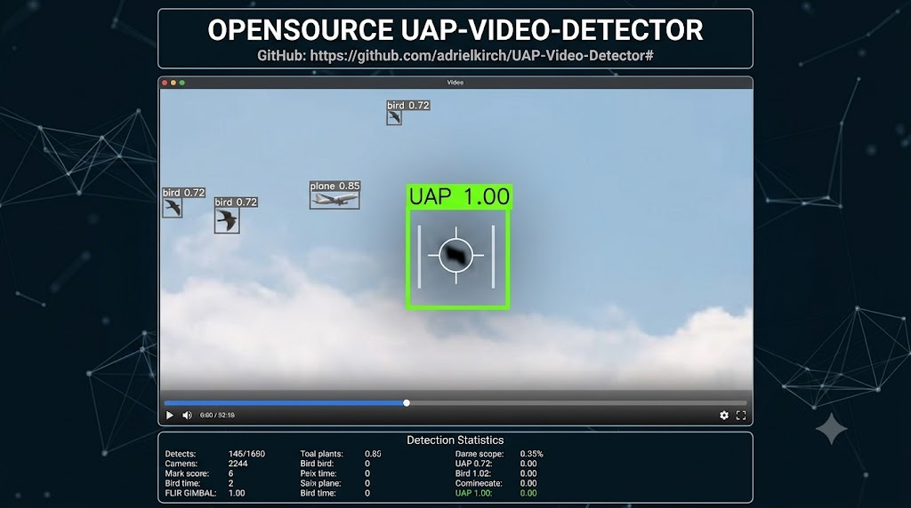

```markdown
# UAP-Video-Detector

**UAP-Video-Detector** is an open-source computer vision pipeline designed to automate the filtering of mundane aerial objects from video streams. By training a robust baseline to highly accurately classify known objects—such as birds, planes, drones, and weather balloons—the system flags low-confidence detections or unclassifiable tracking vectors as potential **Unidentified Anomalous Phenomena (UAP)** for specialized review.

> **The Core Philosophy:** Filter out the knowns to isolate the unknowns.

---

## 🚀 Quick Start

### Prerequisites
* Python 3.10 or higher
* Docker & Docker Compose (Optional, but recommended for instant environment setup)
* CUDA-compatible GPU (Highly recommended for real-time video processing)
```

<br><br><br>




### Local Installation
1. **Clone the repository:**
   ```bash
   git clone [https://github.com/YOUR_USERNAME/UAP-Video-Detector.git](https://github.com/YOUR_USERNAME/UAP-Video-Detector.git)
   cd UAP-Video-Detector


2. **Set up a virtual environment:**
```bash
python -bin/venv venv
source venv/bin/activate  # On Windows use `venv\Scripts\activate`

```


3. **Install dependencies:**
```bash
pip install -r requirements.txt

```


### Running the Detector

Place your input video file into the `data/raw/` folder and execute the main pipeline:

```bash
python src/main.py --source data/raw/sample_sky_feed.mp4 --conf 0.25

```

---

## 🏗️ Repository Structure

The architecture is built cleanly to separate ingestion, deep learning inference, and data orchestration workflows:

```text
uap-video-detector/
├── .github/
│   ├── ISSUE_TEMPLATE/       # Structured bug reports & feature requests
│   └── workflows/            # CI/CD pipelines (automated linting and testing)
├── config/                   # YAML files for tweaking YOLO confidence thresholds
├── data/
│   ├── raw/                  # Input videos and stream configurations
│   └── processed/            # Extracted crops and logs of anomalous events
├── models/                   # Custom trained weights (.pt files)
├── src/                    
│   ├── ingestion/            # Video streaming and frame extraction logic
│   ├── inference/            # YOLO detection wrapper and anomaly filtering rules
│   ├── orchestration/        # Routing engines, local storage, or cloud logging handlers
│   ├── ui/                   
│   │   ├── app.py            # Streamlit dashboard layout or Frontend server entry
│   │   ├── components/       # Custom video players, metric displays, tables
│   │   └── assets/           # UI CSS, custom logos, or web styling
│   └── main.py               # Application entry point
├── tests/                    # Core pipeline unit tests (pytest)
├── docker-compose.yml        # Multi-container local execution environment
└── CONTRIBUTING.md           # Onboarding documentation for developers

```

---

## 🗺️ Project Roadmap

* [ ] **Phase 1:** Core pipeline architecture & basic tracking setup using pre-trained YOLO sets.
* [ ] **Phase 2:** Customized baseline fine-tuning specifically targeting edge-case aerial noise (refraction, birds, satellites).
* [ ] **Phase 3:** Automated extraction engine that clips and stores high-resolution snippets of unclassified visual bounding boxes.
* [ ] **Phase 4:** Agentic orchestration allowing logged anomalies to automatically generate metadata entries for community databases.
*** initiation Povoa01 suggestion 09JUL26***
* [ ] **Phase 1:** Initial input video analysis (file integrity, metadata extraction, multi extention formats).
* [ ] **Phase 2:** PreProcessing Stabilization-Frame enhancement-Noise Reduction (OpenCV or similar).
* [ ] **Phase 3:** YOLO (object detection - identification - localization).
* [ ] **Phase 4:** Tracking Process (frame association - identity - movement - trajectory).
* [ ] **Phase 5:** Scoring Process (UAP high score - crop - confidence level - known pattern - consistency - motion - size - shape).
* [ ] **Phase 6:** Forensic Analysis (motion - lighting - noise - compression - blur - scene integration).
* [ ] **Phase 7:** Analysis Report (final classification - forensic - scores - CGI/IA
*** finalization Povoa01 suggestion 09JUL26***
---

## 🤝 Contributing

We welcome contributions from software engineers, ML researchers, and data-driven UFOlogists alike!

1. Check out the open tickets in our **Issues** tab.
2. Review our `CONTRIBUTING.md` guide before making changes.
3. Open a Pull Request against the `main` branch.

*For speculative ideas, hardware setup discussions, or philosophical questions, please use the **GitHub Discussions** tab rather than open code issues.*

--

## 🚀 Future Horizons & Roadmap

While our primary engine focuses on the physical elimination of known aerial objects, data integrity in the modern era requires us to look beyond the physical sky and into the pixels themselves.

As a secondary but increasingly critical long-term goal, the project aims to integrate pipeline layers designed to detect CGI, deepfakes, generative AI inserts, and advanced digital montages. Ensuring a video hasn't been synthetically manufactured is just as vital as ensuring it isn't a bird. While this is not our primary launch feature, building robust tools to flag digital manipulation is a high-priority milestone on our development roadmap.

---

## 📄 License

This project is licensed under the terms of the **GNU Affero General Public License v3.0 (AGPL-3.0)**. This guarantees that modifications to the detection engines remain open and accessible to the scientific community.
